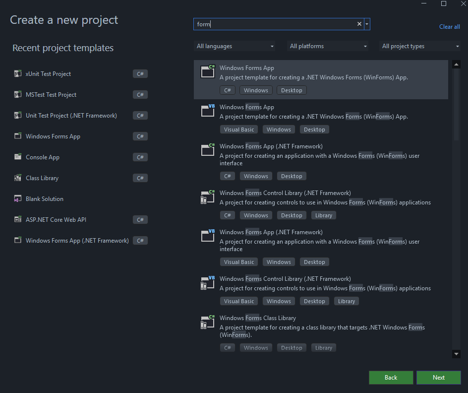
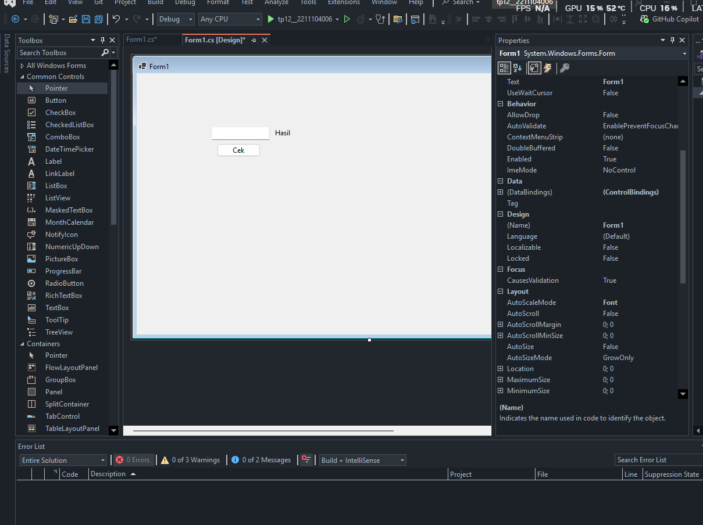
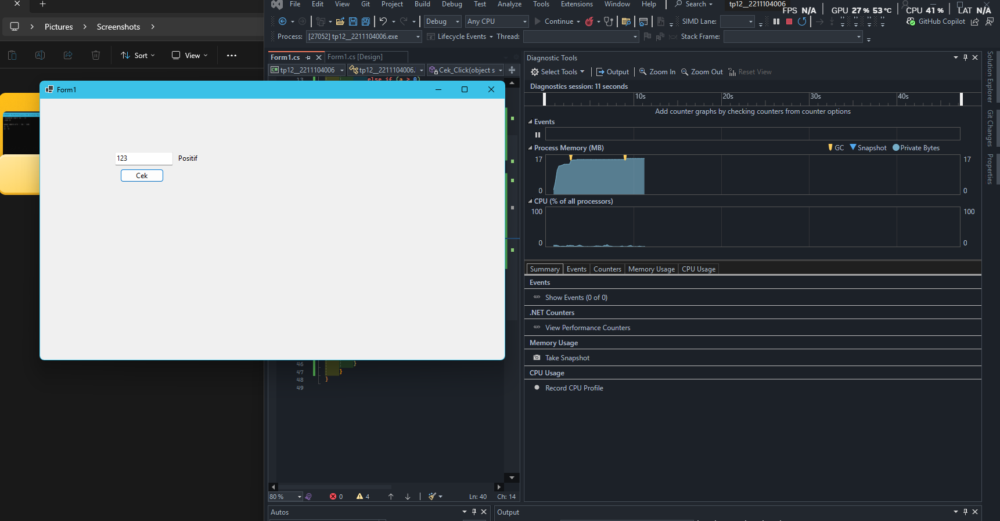

# TUGAS PENDAHULUAN  
## KONSTRUKSI PERANGKAT LUNAK  

### Disusun Oleh:  
**Fadhila Agil Permana** | 2211104006  
**SE-06-01**  

### Asisten Praktikum:  
- Naufal El Kamil Aditya Pratama Rahman  
- Imelda Alfina Palupi Dewi  

### Dosen Pengampu:  
**Yudha Islami Sulistya, S.Kom., M.Cs**  

### PROGRAM STUDI S1 REKAYASA PERANGKAT LUNAK  
### FAKULTAS INFORMATIKA  
### TELKOM UNIVERSITY PURWOKERTO  

---

## Bagian 1: Buat New Project "Windows From APP"   

---

## Bagian 2: BUAT GUI SESUAI DI MODUL (Library)  

---

## Bagian 3: Open Debug Untuk Melihat performa bisa juga shortcut "f5"

