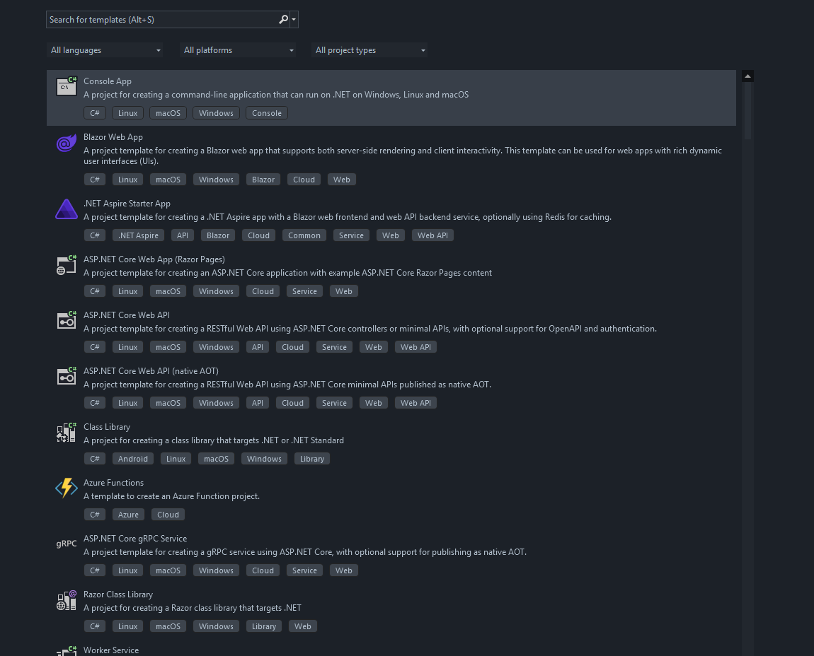
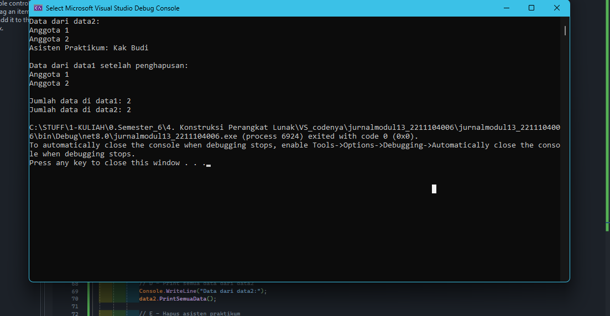

<div align="center">

# TUGAS PENDAHULUAN  
## KONSTRUKSI PERANGKAT LUNAK  


### Disusun Oleh:  
**Fadhila Agil Permana** | 2211104006  
**SE-06-01**  

### Asisten Praktikum:  
- Naufal El Kamil Aditya Pratama Rahman  
- Imelda Alfina Palupi Dewi  

### Dosen Pengampu:  
**Yudha Islami Sulistya, S.Kom., M.Cs**  

### PROGRAM STUDI S1 REKAYASA PERANGKAT LUNAK  
### FAKULTAS INFORMATIKA  
### TELKOM UNIVERSITY PURWOKERTO  

<hr>

</div>

---

## Bagian 1: Buat New Project "Windows From APP"   


---

## Bagian 2: Codenya

```csharp
using System;
using System.Collections.Generic;

public class PusatDataSingleton
{
    private static PusatDataSingleton _instance;
    private List<string> DataTersimpan;

    // Konstruktor private
    private PusatDataSingleton()
    {
        DataTersimpan = new List<string>();
    }

    // Getter singleton
    public static PusatDataSingleton GetDataSingleton()
    {
        if (_instance == null)
        {
            _instance = new PusatDataSingleton();
        }
        return _instance;
    }

    public List<string> GetSemuaData()
    {
        return DataTersimpan;
    }

    public void PrintSemuaData()
    {
        foreach (var data in DataTersimpan)
        {
            Console.WriteLine(data);
        }
    }

    public void AddSebuahData(string input)
    {
        DataTersimpan.Add(input);
    }

    public void HapusSebuahData(int index)
    {
        if (index >= 0 && index < DataTersimpan.Count)
        {
            DataTersimpan.RemoveAt(index);
        }
        else
        {
            Console.WriteLine("Index tidak valid.");
        }
    }

    class Program
    {
        static void Main(string[] args)
        {
            // A & B: Mendapatkan instance singleton
            var data1 = PusatDataSingleton.GetDataSingleton();
            var data2 = PusatDataSingleton.GetDataSingleton();

            // C: Menambahkan data
            data1.AddSebuahData("Anggota 1");
            data1.AddSebuahData("Anggota 2");
            data1.AddSebuahData("Asisten Praktikum: Kak Budi");

            // D: Menampilkan semua data dari data2
            Console.WriteLine("Data dari data2:");
            data2.PrintSemuaData();

            // E: Menghapus data asisten praktikum
            data2.HapusSebuahData(2); // index ke-2 = Asisten Praktikum

            // F: Menampilkan ulang data1 setelah penghapusan
            Console.WriteLine("\nData dari data1 setelah penghapusan:");
            data1.PrintSemuaData();

            // G: Menampilkan jumlah data
            Console.WriteLine($"\nJumlah data di data1: {data1.GetSemuaData().Count}");
            Console.WriteLine($"Jumlah data di data2: {data2.GetSemuaData().Count}");
        }
    }
}
```


---

## Bagian 3: RUN   

---


