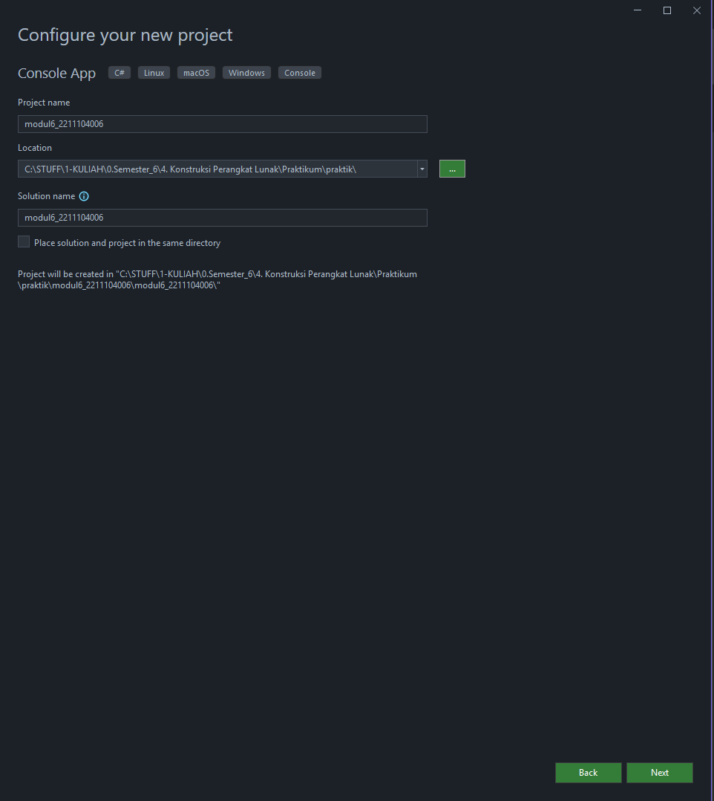
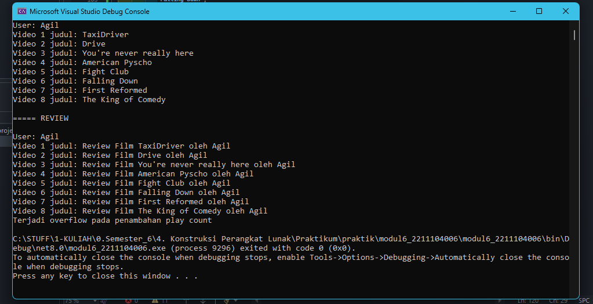

<div align="center">

# TUGAS PENDAHULUAN  
**KONSTRUKSI PERANGKAT LUNAK**  

<br>


<br>

**Disusun Oleh:**  
**Fadhila Agil Permana** | **2211104006**  
**SE-06-01**  

<br>

**Asisten Praktikum:**  
- **Naufal El Kamil Aditya Pratama Rahman**  
- **Imelda Alfina Palupi Dewi**  

<br>

**Dosen Pengampu:**  
**Yudha Islami Sulistya, S.Kom., M.Cs**  

<br>

**PROGRAM STUDI S1 REKAYASA PERANGKAT LUNAK**  
**FAKULTAS INFORMATIKA**  
**TELKOM UNIVERSITY PURWOKERTO**  

<hr>

</div>

---

## KONSTRUKSI PERANGKAT LUNAK

---

### Bagian 1: Buat Console dan Penamaan
<div align="center">

</div>

---

### Bagian 2: Bikin Class Baru

```csharp
using System;
using System.Collections.Generic;
using System.Diagnostics.Contracts;

/// <summary>
/// Representasi dari pengguna SayaTube
/// </summary>
public class SayaTubeUser
{
    public int Id { get; private set; }
    public List<SayaTubeVideo> UploadedVideos { get; private set; }
    public string Username { get; private set; }

    public SayaTubeUser(string username)
    {
        Contract.Requires(username != null, "Username tidak boleh null");
        Contract.Requires(username.Length <= 100, "Panjang username maksimal 100 karakter");

        Random random = new Random();
        Id = random.Next(10000, 99999);
        Username = username;
        UploadedVideos = new List<SayaTubeVideo>();
    }

    public int GetTotalVideoPlayCount()
    {
        int totalPlayCount = 0;
        foreach (SayaTubeVideo video in UploadedVideos)
        {
            totalPlayCount += video.PlayCount;
        }
        return totalPlayCount;
    }

    public void AddVideo(SayaTubeVideo video)
    {
        Contract.Requires(video != null, "Video tidak boleh null");
        Contract.Requires(video.PlayCount < int.MaxValue, "PlayCount video harus kurang dari integer maksimum");

        UploadedVideos.Add(video);
    }

    public void PrintAllVideoPlayCount()
    {
        Console.WriteLine($"User: {Username}");
        for (int i = 0; i < Math.Min(UploadedVideos.Count, 8); i++)
        {
            Console.WriteLine($"Video {i + 1} Judul: {UploadedVideos[i].Title}");
        }
    }
}

/// <summary>
/// Representasi dari video SayaTube
/// </summary>
public class SayaTubeVideo
{
    public int Id { get; private set; }
    public string Title { get; private set; }
    public int PlayCount { get; private set; }

    public SayaTubeVideo(string title)
    {
        Contract.Requires(title != null, "Judul video tidak boleh null");
        Contract.Requires(title.Length <= 200, "Panjang judul video maksimal 200 karakter");

        Random random = new Random();
        Id = random.Next(10000, 99999);
        Title = title;
        PlayCount = 0;
    }

    public void IncreasePlayCount(int count)
    {
        Contract.Requires(count >= 0, "Play count tidak boleh negatif");
        Contract.Requires(count <= 25000000, "Maksimal penambahan play count adalah 25 juta");

        checked
        {
            try
            {
                PlayCount += count;
            }
            catch (OverflowException)
            {
                Console.WriteLine("Terjadi overflow saat menambahkan play count");
            }
        }
    }

    public void PrintVideoDetails()
    {
        Console.WriteLine($"ID: {Id}");
        Console.WriteLine($"Title: {Title}");
        Console.WriteLine($"PlayCount: {PlayCount}");
    }
}

/// <summary>
/// Kelas utama program
/// </summary>
class Program
{
    static void Main(string[] args)
    {
        SayaTubeUser user = new SayaTubeUser("Agil");

        string[] videoTitles = {
            "TaxiDriver", "Drive", "You're never really here", "American Psycho",
            "Fight Club", "Falling Down", "First Reformed", "The King of Comedy",
            "The Dark Knight", "The Dark Knight Rises"
        };

        foreach (string title in videoTitles)
        {
            SayaTubeVideo video = new SayaTubeVideo(title);
            user.AddVideo(video);
        }

        user.PrintAllVideoPlayCount();

        Console.WriteLine("\n===== REVIEW\n");

        SayaTubeUser reviewUser = new SayaTubeUser("Agil");
        foreach (string title in videoTitles)
        {
            SayaTubeVideo video = new SayaTubeVideo($"Review Film {title} oleh Agil");
            reviewUser.AddVideo(video);
        }

        reviewUser.PrintAllVideoPlayCount();

        // Uji validasi null title
        try
        {
            SayaTubeVideo invalidVideo = new SayaTubeVideo(null);
        }
        catch (Exception ex)
        {
            Console.WriteLine(ex.Message);
        }

        try
        {
            SayaTubeUser invalidUser = new SayaTubeUser(null);
        }
        catch (Exception ex)
        {
            Console.WriteLine(ex.Message);
        }

        SayaTubeVideo testVideo = new SayaTubeVideo("Test Video");
        try
        {
            testVideo.IncreasePlayCount(30000000);
        }
        catch (Exception ex)
        {
            Console.WriteLine(ex.Message);
        }

        try
        {
            testVideo.IncreasePlayCount(-1);
        }
        catch (Exception ex)
        {
            Console.WriteLine(ex.Message);
        }

        // Uji overflow play count
        try
        {
            for (int i = 0; i < 10; i++)
            {
                testVideo.IncreasePlayCount(int.MaxValue / 10);
            }
        }
        catch (Exception ex)
        {
            Console.WriteLine(ex.Message);
        }
    }
}
```

---

### Bagian 3: Output
<div align="center">

</div>

---

### Bagian 4: Penjelasan Perubahan Kode

📌 **Perubahan yang Dilakukan (Refactoring):**  
- **Naming Convention:** Memastikan semua properti, method, dan variabel mengikuti **PascalCase** (untuk class, method, dan properti) dan **camelCase** (untuk variabel lokal).  
- **Whitespace dan Indentasi:** Diperbaiki agar konsisten (menggunakan 4 spasi/tab).  
- **Deklarasi Variabel:** Menggunakan tipe eksplisit (**string**, **int**, **var** sesuai konteks).  
- **Comments:** Menambahkan komentar pada bagian penting kode untuk meningkatkan keterbacaan.
