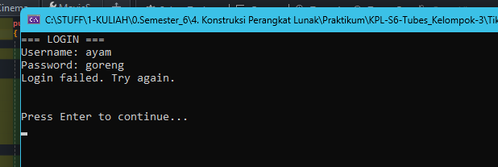
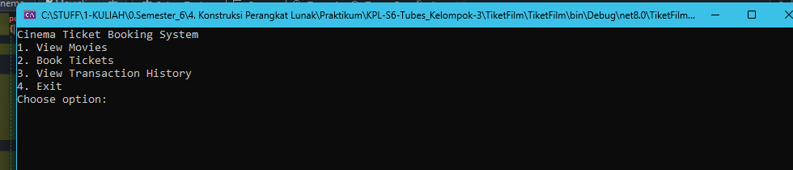

<div align="center">

# TUGAS PENDAHULUAN  
## KONSTRUKSI PERANGKAT LUNAK  


---

### Disusun Oleh:  
**Fadhila Agil Permana** | 2211104006  
**SE-06-01**  

---

### Asisten Praktikum:  
- Naufal El Kamil Aditya Pratama Rahman  
- Imelda Alfina Palupi Dewi  

---

### Dosen Pengampu:  
**Yudha Islami Sulistya, S.Kom., M.Cs**  

---

### PROGRAM STUDI S1 REKAYASA PERANGKAT LUNAK  
### FAKULTAS INFORMATIKA  
### TELKOM UNIVERSITY PURWOKERTO  


</div>


---

# Review Tugas Besar - Jurnal 15

[COMMIT HISTORY <---- ⭐⭐⭐⭐⭐⭐](https://github.com/SpiNoice01/KPL-S6-Tubes_Kelompok-3/commit/46dbfbd9bc6587257f2911d86c8283eb3a0b940f)
---


## 1. Menambahkan Fungsi Login (Autentikasi)

**Tujuan:**  
Memastikan aplikasi (Cinema Ticket Booking) hanya dapat diakses oleh pengguna yang telah login.

---

## 2. Penambahan Model (User)

**Kode:**

```csharp
public class User
{
    public string Username { get; set; }
    public string Password { get; set; }
}
```

**Penjelasan:**  
- Model ini menyimpan data pengguna ([`Username`](command:_github.copilot.openSymbolFromReferences?%5B%22%22%2C%5B%7B%22uri%22%3A%7B%22scheme%22%3A%22file%22%2C%22authority%22%3A%22%22%2C%22path%22%3A%22%2Fc%3A%2FSTUFF%2F1-KULIAH%2F0.Semester_6%2F4.%20Konstruksi%20Perangkat%20Lunak%2FPraktikum%2FKPL_FadhilaAgilPermana_2211104006_SE-06-1%2F15_Review_Tugas_Besar%2FJurnal15.md%22%2C%22query%22%3A%22%22%2C%22fragment%22%3A%22%22%7D%2C%22pos%22%3A%7B%22line%22%3A46%2C%22character%22%3A18%7D%7D%5D%2C%2283eb6a73-ce16-4a54-adb6-6ee5607e842c%22%5D "Go to definition") dan [`Password`](command:_github.copilot.openSymbolFromReferences?%5B%22%22%2C%5B%7B%22uri%22%3A%7B%22scheme%22%3A%22file%22%2C%22authority%22%3A%22%22%2C%22path%22%3A%22%2Fc%3A%2FSTUFF%2F1-KULIAH%2F0.Semester_6%2F4.%20Konstruksi%20Perangkat%20Lunak%2FPraktikum%2FKPL_FadhilaAgilPermana_2211104006_SE-06-1%2F15_Review_Tugas_Besar%2FJurnal15.md%22%2C%22query%22%3A%22%22%2C%22fragment%22%3A%22%22%7D%2C%22pos%22%3A%7B%22line%22%3A47%2C%22character%22%3A18%7D%7D%5D%2C%2283eb6a73-ce16-4a54-adb6-6ee5607e842c%22%5D "Go to definition")) untuk proses login.  
- Properti [`Username`](command:_github.copilot.openSymbolFromReferences?%5B%22%22%2C%5B%7B%22uri%22%3A%7B%22scheme%22%3A%22file%22%2C%22authority%22%3A%22%22%2C%22path%22%3A%22%2Fc%3A%2FSTUFF%2F1-KULIAH%2F0.Semester_6%2F4.%20Konstruksi%20Perangkat%20Lunak%2FPraktikum%2FKPL_FadhilaAgilPermana_2211104006_SE-06-1%2F15_Review_Tugas_Besar%2FJurnal15.md%22%2C%22query%22%3A%22%22%2C%22fragment%22%3A%22%22%7D%2C%22pos%22%3A%7B%22line%22%3A46%2C%22character%22%3A18%7D%7D%5D%2C%2283eb6a73-ce16-4a54-adb6-6ee5607e842c%22%5D "Go to definition") dan [`Password`](command:_github.copilot.openSymbolFromReferences?%5B%22%22%2C%5B%7B%22uri%22%3A%7B%22scheme%22%3A%22file%22%2C%22authority%22%3A%22%22%2C%22path%22%3A%22%2Fc%3A%2FSTUFF%2F1-KULIAH%2F0.Semester_6%2F4.%20Konstruksi%20Perangkat%20Lunak%2FPraktikum%2FKPL_FadhilaAgilPermana_2211104006_SE-06-1%2F15_Review_Tugas_Besar%2FJurnal15.md%22%2C%22query%22%3A%22%22%2C%22fragment%22%3A%22%22%7D%2C%22pos%22%3A%7B%22line%22%3A47%2C%22character%22%3A18%7D%7D%5D%2C%2283eb6a73-ce16-4a54-adb6-6ee5607e842c%22%5D "Go to definition") memungkinkan penyimpanan dan pembacaan data dari file JSON.

---

## 3. Penambahan Repository (JsonUserRepository)

**Kode:**

```csharp
public interface IUserRepository
{
    User GetUserByUsername(string username);
    IReadOnlyList<User> GetAllUsers();
}

public class JsonUserRepository : IUserRepository
{
    private const string UserFile = "users.json";

    public User GetUserByUsername(string username)
    {
        return GetAllUsers().FirstOrDefault(u => u.Username == username);
    }

    public IReadOnlyList<User> GetAllUsers()
    {
        if (!File.Exists(UserFile))
            return new List<User>().AsReadOnly();
        try
        {
            var users = JsonConvert.DeserializeObject<List<User>>(File.ReadAllText(UserFile)) ?? new List<User>();
            return users.AsReadOnly();
        }
        catch (Exception ex)
        {
            throw new RepositoryException("Failed to load users", ex);
        }
    }
}
```

**Penjelasan:**  
- Interface [`IUserRepository`](command:_github.copilot.openSymbolFromReferences?%5B%22%22%2C%5B%7B%22uri%22%3A%7B%22scheme%22%3A%22file%22%2C%22authority%22%3A%22%22%2C%22path%22%3A%22%2Fc%3A%2FSTUFF%2F1-KULIAH%2F0.Semester_6%2F4.%20Konstruksi%20Perangkat%20Lunak%2FPraktikum%2FKPL_FadhilaAgilPermana_2211104006_SE-06-1%2F15_Review_Tugas_Besar%2FJurnal15.md%22%2C%22query%22%3A%22%22%2C%22fragment%22%3A%22%22%7D%2C%22pos%22%3A%7B%22line%22%3A62%2C%22character%22%3A17%7D%7D%5D%2C%2283eb6a73-ce16-4a54-adb6-6ee5607e842c%22%5D "Go to definition") mendefinisikan dua fungsi:  
  - `GetUserByUsername(string username)`: mencari user berdasarkan username.  
  - `GetAllUsers()`: membaca semua data user dari file JSON.  
- Class [`JsonUserRepository`](command:_github.copilot.openSymbolFromReferences?%5B%22%22%2C%5B%7B%22uri%22%3A%7B%22scheme%22%3A%22file%22%2C%22authority%22%3A%22%22%2C%22path%22%3A%22%2Fc%3A%2FSTUFF%2F1-KULIAH%2F0.Semester_6%2F4.%20Konstruksi%20Perangkat%20Lunak%2FPraktikum%2FKPL_FadhilaAgilPermana_2211104006_SE-06-1%2F15_Review_Tugas_Besar%2FJurnal15.md%22%2C%22query%22%3A%22%22%2C%22fragment%22%3A%22%22%7D%2C%22pos%22%3A%7B%22line%22%3A57%2C%22character%22%3A29%7D%7D%5D%2C%2283eb6a73-ce16-4a54-adb6-6ee5607e842c%22%5D "Go to definition") mengimplementasikan interface tersebut:  
  - File JSON (`users.json`) dibaca dan di-deserialize menjadi list [`User`](command:_github.copilot.openSymbolFromReferences?%5B%22%22%2C%5B%7B%22uri%22%3A%7B%22scheme%22%3A%22file%22%2C%22authority%22%3A%22%22%2C%22path%22%3A%22%2Fc%3A%2FSTUFF%2F1-KULIAH%2F0.Semester_6%2F4.%20Konstruksi%20Perangkat%20Lunak%2FPraktikum%2FKPL_FadhilaAgilPermana_2211104006_SE-06-1%2F15_Review_Tugas_Besar%2FJurnal15.md%22%2C%22query%22%3A%22%22%2C%22fragment%22%3A%22%22%7D%2C%22pos%22%3A%7B%22line%22%3A39%2C%22character%22%3A24%7D%7D%5D%2C%2283eb6a73-ce16-4a54-adb6-6ee5607e842c%22%5D "Go to definition").  
  - Jika file tidak ada, list kosong dikembalikan.  
  - Jika terjadi error, exception ([`RepositoryException`](command:_github.copilot.openSymbolFromReferences?%5B%22%22%2C%5B%7B%22uri%22%3A%7B%22scheme%22%3A%22file%22%2C%22authority%22%3A%22%22%2C%22path%22%3A%22%2Fc%3A%2FSTUFF%2F1-KULIAH%2F0.Semester_6%2F4.%20Konstruksi%20Perangkat%20Lunak%2FPraktikum%2FKPL_FadhilaAgilPermana_2211104006_SE-06-1%2F15_Review_Tugas_Besar%2FJurnal15.md%22%2C%22query%22%3A%22%22%2C%22fragment%22%3A%22%22%7D%2C%22pos%22%3A%7B%22line%22%3A88%2C%22character%22%3A22%7D%7D%5D%2C%2283eb6a73-ce16-4a54-adb6-6ee5607e842c%22%5D "Go to definition")) dilempar.

---

## 4. Penambahan Service (AuthService)

**Kode:**

```csharp
public class AuthService
{
    private readonly IUserRepository _userRepository;
    public AuthService(IUserRepository userRepository)
    {
        _userRepository = userRepository ?? throw new ArgumentNullException(nameof(userRepository));
    }

    public bool Login(string username, string password)
    {
        var user = _userRepository.GetUserByUsername(username);
        if (user == null) return false;
        return user.Password == password;
    }
}
```

**Penjelasan:**  
- Service ini menerima [`IUserRepository`](command:_github.copilot.openSymbolFromReferences?%5B%22%22%2C%5B%7B%22uri%22%3A%7B%22scheme%22%3A%22file%22%2C%22authority%22%3A%22%22%2C%22path%22%3A%22%2Fc%3A%2FSTUFF%2F1-KULIAH%2F0.Semester_6%2F4.%20Konstruksi%20Perangkat%20Lunak%2FPraktikum%2FKPL_FadhilaAgilPermana_2211104006_SE-06-1%2F15_Review_Tugas_Besar%2FJurnal15.md%22%2C%22query%22%3A%22%22%2C%22fragment%22%3A%22%22%7D%2C%22pos%22%3A%7B%22line%22%3A62%2C%22character%22%3A17%7D%7D%5D%2C%2283eb6a73-ce16-4a54-adb6-6ee5607e842c%22%5D "Go to definition") sebagai dependensi.  
- Fungsi `Login(string username, string password)` melakukan autentikasi:  
  - Cari user berdasarkan username.  
  - Jika user tidak ditemukan, login gagal.  
  - Jika ditemukan, bandingkan password yang diinput dengan password user.

---

## 5. Modifikasi UI (CinemaApp)

**Kode:**

```csharp
public class CinemaApp
{
    private readonly AuthService _authService;
    private User _currentUser;

    public CinemaApp(MovieService movieService, BookingService bookingService, SeatService seatService, IUserInterface ui, AuthService authService)
    {
        _authService = authService ?? throw new ArgumentNullException(nameof(authService));
    }

    public void Run()
    {
        bool loggedIn = false;
        do
        {
            _ui.ClearScreen();
            _ui.DisplayMessage("=== LOGIN ===");
            var username = _ui.GetUserInput("Username: ");
            var password = _ui.GetUserInput("Password: ");
            if (_authService.Login(username, password))
            {
                loggedIn = true;
                _ui.DisplayMessage("Login successful!\n");
            }
            else
            {
                _ui.DisplayMessage("Login failed. Try again.\n");
                _ui.WaitForUser();
            }
        } while (!loggedIn);

        // Lanjut ke menu utama
    }
}
```

**Penjelasan:**  
- [`CinemaApp`](command:_github.copilot.openSymbolFromReferences?%5B%22%22%2C%5B%7B%22uri%22%3A%7B%22scheme%22%3A%22file%22%2C%22authority%22%3A%22%22%2C%22path%22%3A%22%2Fc%3A%2FSTUFF%2F1-KULIAH%2F0.Semester_6%2F4.%20Konstruksi%20Perangkat%20Lunak%2FPraktikum%2FKPL_FadhilaAgilPermana_2211104006_SE-06-1%2F15_Review_Tugas_Besar%2FJurnal15.md%22%2C%22query%22%3A%22%22%2C%22fragment%22%3A%22%22%7D%2C%22pos%22%3A%7B%22line%22%3A136%2C%22character%22%3A21%7D%7D%5D%2C%2283eb6a73-ce16-4a54-adb6-6ee5607e842c%22%5D "Go to definition") menerima [`AuthService`](command:_github.copilot.openSymbolFromReferences?%5B%22%22%2C%5B%7B%22uri%22%3A%7B%22scheme%22%3A%22file%22%2C%22authority%22%3A%22%22%2C%22path%22%3A%22%2Fc%3A%2FSTUFF%2F1-KULIAH%2F0.Semester_6%2F4.%20Konstruksi%20Perangkat%20Lunak%2FPraktikum%2FKPL_FadhilaAgilPermana_2211104006_SE-06-1%2F15_Review_Tugas_Besar%2FJurnal15.md%22%2C%22query%22%3A%22%22%2C%22fragment%22%3A%22%22%7D%2C%22pos%22%3A%7B%22line%22%3A105%2C%22character%22%3A26%7D%7D%5D%2C%2283eb6a73-ce16-4a54-adb6-6ee5607e842c%22%5D "Go to definition") sebagai dependensi.  
- Proses login dilakukan di awal fungsi `Run()`.  
- Jika login berhasil, aplikasi lanjut ke menu utama.

---

## 6. File Data (users.json)

**Kode:**

```json
[
  { "Username": "admin", "Password": "admin123" },
  { "Username": "user", "Password": "user123" }
]
```

**Penjelasan:**  
- File ini menyimpan data pengguna untuk login.  
- File harus berada di folder output agar dapat dibaca oleh [`JsonUserRepository`](command:_github.copilot.openSymbolFromReferences?%5B%22%22%2C%5B%7B%22uri%22%3A%7B%22scheme%22%3A%22file%22%2C%22authority%22%3A%22%22%2C%22path%22%3A%22%2Fc%3A%2FSTUFF%2F1-KULIAH%2F0.Semester_6%2F4.%20Konstruksi%20Perangkat%20Lunak%2FPraktikum%2FKPL_FadhilaAgilPermana_2211104006_SE-06-1%2F15_Review_Tugas_Besar%2FJurnal15.md%22%2C%22query%22%3A%22%22%2C%22fragment%22%3A%22%22%7D%2C%22pos%22%3A%7B%22line%22%3A57%2C%22character%22%3A29%7D%7D%5D%2C%2283eb6a73-ce16-4a54-adb6-6ee5607e842c%22%5D "Go to definition").

---

## 7. Catatan Penting (Lokasi File JSON)

**Masalah:**  
- File JSON (`users.json`) tidak ditemukan saat aplikasi dijalankan dari folder output.  

**Solusi:**  
- Pastikan file JSON disalin ke folder output saat build.  
- Di Visual Studio:  
  - Klik kanan file JSON → Properties → “Copy to Output Directory” → “Copy if newer”.  
- Jika menggunakan editor lain, tambahkan pengaturan di file `.csproj`.


---
# Run Aplikasi

Berikut adalah hasil tampilan aplikasi setelah dijalankan:

### Screenshot 1


### Screenshot 2

---

## Kesimpulan

- Fitur login ditambahkan dengan:  
  - Model ([`User`](command:_github.copilot.openSymbolFromReferences?%5B%22%22%2C%5B%7B%22uri%22%3A%7B%22scheme%22%3A%22file%22%2C%22authority%22%3A%22%22%2C%22path%22%3A%22%2Fc%3A%2FSTUFF%2F1-KULIAH%2F0.Semester_6%2F4.%20Konstruksi%20Perangkat%20Lunak%2FPraktikum%2FKPL_FadhilaAgilPermana_2211104006_SE-06-1%2F15_Review_Tugas_Besar%2FJurnal15.md%22%2C%22query%22%3A%22%22%2C%22fragment%22%3A%22%22%7D%2C%22pos%22%3A%7B%22line%22%3A39%2C%22character%22%3A24%7D%7D%5D%2C%2283eb6a73-ce16-4a54-adb6-6ee5607e842c%22%5D "Go to definition")) untuk menyimpan data pengguna.  
  - Repository ([`JsonUserRepository`](command:_github.copilot.openSymbolFromReferences?%5B%22%22%2C%5B%7B%22uri%22%3A%7B%22scheme%22%3A%22file%22%2C%22authority%22%3A%22%22%2C%22path%22%3A%22%2Fc%3A%2FSTUFF%2F1-KULIAH%2F0.Semester_6%2F4.%20Konstruksi%20Perangkat%20Lunak%2FPraktikum%2FKPL_FadhilaAgilPermana_2211104006_SE-06-1%2F15_Review_Tugas_Besar%2FJurnal15.md%22%2C%22query%22%3A%22%22%2C%22fragment%22%3A%22%22%7D%2C%22pos%22%3A%7B%22line%22%3A57%2C%22character%22%3A29%7D%7D%5D%2C%2283eb6a73-ce16-4a54-adb6-6ee5607e842c%22%5D "Go to definition")) untuk membaca data dari file JSON.  
  - Service ([`AuthService`](command:_github.copilot.openSymbolFromReferences?%5B%22%22%2C%5B%7B%22uri%22%3A%7B%22scheme%22%3A%22file%22%2C%22authority%22%3A%22%22%2C%22path%22%3A%22%2Fc%3A%2FSTUFF%2F1-KULIAH%2F0.Semester_6%2F4.%20Konstruksi%20Perangkat%20Lunak%2FPraktikum%2FKPL_FadhilaAgilPermana_2211104006_SE-06-1%2F15_Review_Tugas_Besar%2FJurnal15.md%22%2C%22query%22%3A%22%22%2C%22fragment%22%3A%22%22%7D%2C%22pos%22%3A%7B%22line%22%3A105%2C%22character%22%3A26%7D%7D%5D%2C%2283eb6a73-ce16-4a54-adb6-6ee5607e842c%22%5D "Go to definition")) untuk autentikasi.  
  - Modifikasi UI ([`CinemaApp`](command:_github.copilot.openSymbolFromReferences?%5B%22%22%2C%5B%7B%22uri%22%3A%7B%22scheme%22%3A%22file%22%2C%22authority%22%3A%22%22%2C%22path%22%3A%22%2Fc%3A%2FSTUFF%2F1-KULIAH%2F0.Semester_6%2F4.%20Konstruksi%20Perangkat%20Lunak%2FPraktikum%2FKPL_FadhilaAgilPermana_2211104006_SE-06-1%2F15_Review_Tugas_Besar%2FJurnal15.md%22%2C%22query%22%3A%22%22%2C%22fragment%22%3A%22%22%7D%2C%22pos%22%3A%7B%22line%22%3A136%2C%22character%22%3A21%7D%7D%5D%2C%2283eb6a73-ce16-4a54-adb6-6ee5607e842c%22%5D "Go to definition")) untuk proses login.  
- File JSON harus ada di folder output agar login berjalan normal.
---
